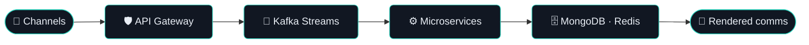

<!-- Banner -->

  

<!-- Typing animation -->

  

<!-- Social badges -->

  
  
  
  

---

### 🏛️ What I architect

> **Cloud-native, event-driven platforms** built on Domain-Driven Design — resilient, observable, and secured by a Zero-Trust mesh. Currently Technical Lead Architect for a multi-channel **Customer Communications Management (CCM)** platform, with a production **Agentic AI layer (RAG · MCP)** on top.

---

### 🚀 About me

- 🏛️ **Technical Lead Architect** — platform-wide architecture for high-scale, distributed systems
- 🔀 **Event-Driven Architecture** — Kafka Streams, event sourcing, retry topics & DLT at enterprise scale
- 🛡️ **Zero Trust Security** — Istio, OAuth2/JWT, mTLS, Vault — GDPR / DPDP / ISO 27001 aligned
- 🤖 **Adopting Agentic AI** — RAG (vector search), ReAct loops, and MCP servers extending platforms
- 👥 **19+ years** architecting, leading and mentoring high-performing engineering teams

### 🧰 Tech Stack

  

  
  
  
  

### 📊 GitHub Stats

  
  

---

### 🏆 Selected impact

- **8× throughput** — re-architected a reactive PDF-generation pipeline with a tuned WebClient connection pool
- **30%+ cost cut** — monolithic financial systems → auto-scaling AWS microservices
- **10K+ events/sec** — real-time fraud detection with zero downtime
- **50K+ concurrent users** — event-driven gaming ecosystem with zero critical incidents

  

